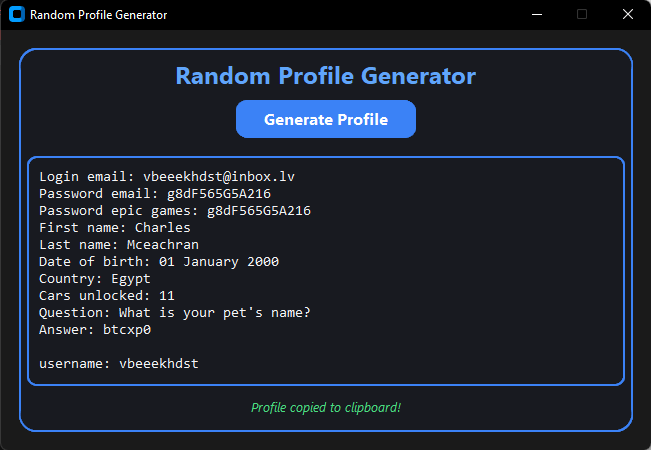

<h1 align="center">Random Profile Generator for inbox.lv</h1>

<p align="center">
  <b>Stop wasting time brainstorming names or usernames get instant, ready-to-use profiles with one click.</b>
</p>

<p align="center">
  
  
  
  
</p>

---

## Why Use This Project?

- **Ultra-fast startup**: Launches in milliseconds
- **Minimal dependencies**: Only loads what's needed, when needed
- **Modern, clean GUI**: Beautiful dark theme with colorful accents
- **Cross-platform**: Works on Windows, macOS, and Linux

---

## Installation

1. **Clone the repository**
   ```bash
   git clone https://github.com/Lordiod/Random-Profile-Generator-for-inbox.lv.git
   cd Random-Profile-Generator-for-inbox.lv
   ```
2. **Install dependencies**
   ```bash
   pip install -r requirements.txt
   ```

---

## Usage

### Launch the GUI
```bash
python main.py
```

---


## Features

- **Instant startup**: Millisecond launch times
- **Auto clipboard**: Profiles are auto-copied
- **Cross-platform**: Windows, macOS, Linux

---

## Screenshots

<p align="center">
  
</p>

---

## Project Structure

```text
Random-Profile-Generator-for-inbox.lv/
├── assets/
│   └── app.png
├── src/
│   ├── gui.py
│   └── profile_generator.py
├── main.py
├── requirements.txt
└── README.md
```

---

## Contributing

Contributions are welcome! Please open an issue or submit a pull request.

---

## Getting Help

If you have questions, suggestions, or need help, please open an [issue](https://github.com/Lordiod/Random-Profile-Generator-for-inbox.lv/issues).

---

## License

MIT License – see [LICENSE](LICENSE) for details.
